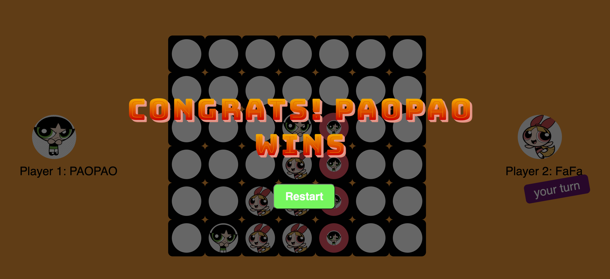

# ConnectFour

# Preview

-   This is a lightweight design game and very easy to hands-on, even 5-year children can play.
-   Support 2-player-battle mode and user also could play with themselves.
-   When user clicking the target pole there is a chess piece from the top droping down. If a player could make FOUR pieces in a line(horizontal/vertical/diagonal),then this player win.

 
 

## 🔎 Game User Interface

## 🔎 WIN Animation 
